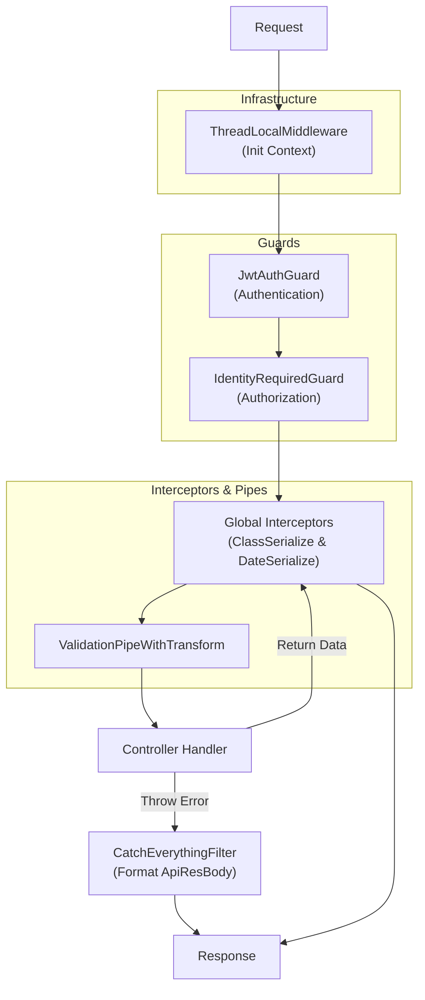

# Project Introduction

## 1. 工程结构 (Project Structure)

本工程采用 **Nx Monorepo** 架构，主要分为 `apps` 和 `libs` 两个目录。

### Apps (`apps/`)

- 存放具体的业务进程入口（Application）。
- 每个 App 代表一个独立运行的服务或微服务。

### Libs (`libs/`)

代码复用的核心区域，分为以下三个层级：

- **`libs/core`**: **跨项目通用基础设施**。
    - 底层技术组件，不包含任何具体的业务逻辑。
    - 例如：`nest/als` (ThreadLocal), `nest/cache` (Redis封装), `nest/jwt-auth` (认证鉴权), `config` 等。
- **`libs/common`**: **本项目通用业务逻辑**。
    - 包含本项目（wjy2026）特定的业务公共模块。
    - 例如：`guards/identity-required` (身份校验), `shared` (通用业务服务) 等。
- **`libs/entities`**: **数据库实体定义**。
    - 存放所有 TypeORM Entity 定义，供 `apps` 和 `libs` 引用。

## 2. 核心模块说明 (Core Modules)

| 模块                          | 类型               | 作用                                                                        | 位置                            |
| :---------------------------- | :----------------- | :-------------------------------------------------------------------------- | :------------------------------ |
| **ThreadLocal**               | Service/Middleware | 基于 `AsyncLocalStorage` 实现请求上下文隔离，用于存储用户信息、TraceID 等。 | `libs/core/src/nest/als`        |
| **JwtAuthGuard**              | Guard              | 全局/路由级别的 JWT 认证守卫，解析 Token 并注入 User 到 Request。           | `libs/core/src/nest/jwt-auth`   |
| **IdentityRequired**          | Guard/Decorator    | 业务权限守卫，用于校验用户角色（如 `student`, `hospital_admin`）。          | `libs/common/src/shared/guards` |
| **CacheService**              | Service            | Redis 缓存服务，提供 `wrap` 等高级封装。                                    | `libs/core/src/nest/cache`      |
| **ClassSerializeInterceptor** | Interceptor        | 负责将实体对象根据类装饰器规则（`@Exclude`, `@Expose`）转换为纯对象。       | `libs/core/src/nest/transform`  |
| **DateSerializeInterceptor**  | Interceptor        | 统一处理响应中的日期格式化及客户端时区转换。                                | `libs/core/src/nest/transform`  |
| **GlobalModule**              | Module             | 注册全局 Filters, Pipes, Interceptors (如序列化和日期处理)。                | `libs/core/src/nest`            |
| **RequestLogsModule**         | Module/Interceptor | HTTP 请求日志，访问日志与持久化两个独立开关；支持 `@IgnoreRequestLog`/`@CaptureRequestLogBody`。 | `libs/core/src/nest/request-logs` |
| **HealthModule**              | Module             | 进程健康监测，暴露 `/health`(liveness) 与 `/health/ready`(readiness)，`@HealthIndicator` 扩展。 | `libs/core/src/nest/health`     |
| **setupAppLogger**            | Bootstrap          | 应用日志异步滚动文件落盘（默认关闭，`APP_LOG_FILE_*` 驱动）。              | `libs/core/src/nest/log-file`   |

> 上述三个能力的设计详情分别见 [request-log.md](./request-log.md)、[health-check.md](./health-check.md)、[log-file.md](./log-file.md)。

## 3. 全局基础设施 (Global Infrastructure)

工程在 `GlobalModule` 中注册了以下核心拦截器和过滤器，作用于所有请求：

- **`CatchEverythingFilter` (Global API Filter)**
    - 统一捕获所有异常（包括 NestJSHttpException、ValidationException、BizError）。
    - 将响应格式化为 `ApiResBody` 标准结构。
    - 自动处理 `BizError` 并映射到相应的 HTTP 状态码。

- **`ValidationPipeWithTransform` (Global Pipe)**
    - 全局启用 DTO 验证 (`class-validator`) 和 转换 (`class-transformer`)。
    - 配合 `ValidationException` 返回详细的字段校验错误信息。

- **`ClassSerializeInterceptor` (Global Interceptor)**
    - 在数据返回前最先执行（响应侧），利用 `class-transformer` 的 `instanceToPlain` 实现。
    - 尊重实体类上的 `@Exclude`, `@Expose` 等装饰器，支持 Getter 虚拟属性序列化。
    - 配合 VO (Value Object) 模式实现精细的接口数据控制。

- **`DateSerializeInterceptor` (Global Interceptor)**
    - 在序列化完成后执行，对 Plain Object 进行递归遍历。
    - 统一处理响应中的 `Date` 对象，默认格式化为 `YYYY-MM-DD HH:mm:ss`。
    - 支持通过请求头 `x-timezone` 处理客户端时区转换。

## 4. NestJS Request Flow

请求在当前工程中的处理流转顺序如下：

